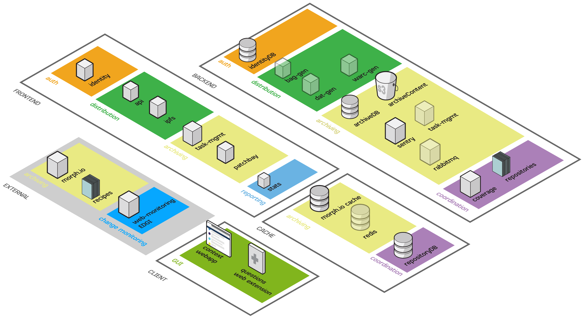

# Proposed Services Overview

This repo lays out the roadmap for the new archivers 2.0 dev cycle. Everything here is subject to rapid change while we build tech & gather community feedback.

## Useful Documents:

### [Archivers 1.0 Lessons](archivers_1_lessons.md)
*lessons learned from archivers 1.0 workflow*

### [Workflow Changes](workflow_changes.md)
*high-level overview of proposed workflow changes*

### [Timeline of services](services_story.md)
*explains how we've gotten to this point.*

### [Roadmap](roadmap.md)
*roadmap of major milestones*

### [Proposed Services List](services_list.md)
*Synopsis of each service with links to project repos*

### [Service Definition](service_defintion.md)
*Definition of what a successful service looks like*

### [Realtimeboard](https://realtimeboard.com/app/board/o9J_k05Adyw=/)
*Diagramming how services connect (Work In Progress)*

### [Metadata](metadata.md)
*Proposed Metadata Spec for dataset metadata*
