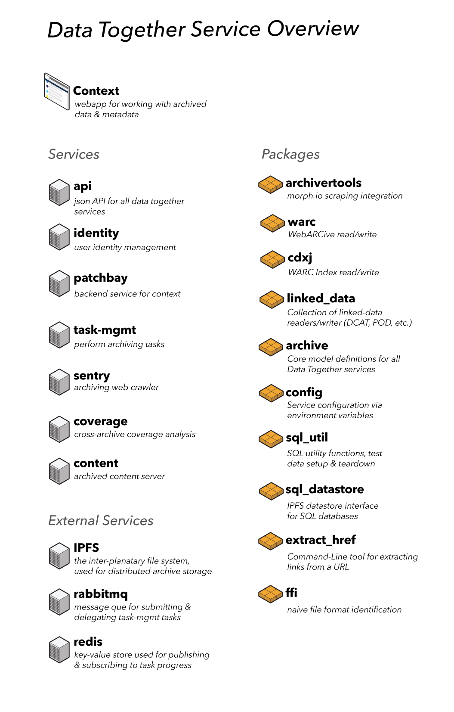

# Data Together Technical Roadmap & Service Overview

### Repo Links
Each repository should carry with it it's own roadmap, defined by milestones. Check each repo's `readme.md` for details

* [ api](https://github.com/datatogether/api)
* [ archive](https://github.com/datatogether/archive)
* [ archivertools](https://github.com/datatogether/archivertools)
* [ cdxj](https://github.com/datatogether/cdxj)
* [ config](https://github.com/datatogether/config)
* [ content](https://github.com/datatogether/content)
* [ coverage](https://github.com/datatogether/coverage)
* [ extract_href](https://github.com/datatogether/extract_href)
* [ ffi](https://github.com/datatogether/ffi)
* [ identity](https://github.com/datatogether/identity)
* [ ipfs](https://github.com/ipfs/go-ipfs)
* [ linked_data](https://github.com/datatogether/linked_data)
* [ patchbay](https://github.com/datatogether/patchbay)
* [ postgres](https://github.com/postgres/postgres)
* [ rabbitmq](https://github.com/rabbitmq/rabbitmq-server)
* [ redis](https://github.com/antirez/redis)
* [ sentry](https://github.com/datatogether/sentry)
* [ sql_datastore](https://github.com/datatogether/sql_datastore)
* [ sql_util](https://github.com/datatogether/sql_util)
* [ task-mgmt](https://github.com/datatogether/mgmt)
* [ warc](https://github.com/datatogether/warc)